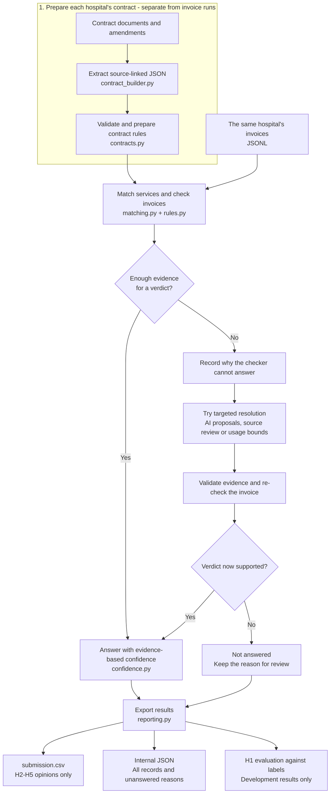

# Hospital invoice auditor

Each hospital is checked against **its own contract**. Contract JSON supplies
the rules. When a service description or source unit needs review, a specialized
agent can propose an interpretation; code validates it before using it. Cases
that still cannot be decided remain explicitly **not answered**.

## Workflow

Prepare each hospital's contract JSON once, then reuse it to audit that hospital's
invoices. **AI proposes interpretations; code validates them and decides the result.**



**What happens in targeted resolution?**

- **Unclear description:** an AI route proposes a service match; code checks its evidence.
- **Unclear billing unit:** review the original clauses, with AI assistance where useful;
  genuinely ambiguous wording stays unresolved.
- **Patient history or volume discount:** code checks minimum/maximum possible usage;
  proceed only when the uncertainty cannot change the result.

This is the conceptual flow: source-unit review can happen while preparing the
rules, before invoice pricing. H1 replays its frozen, verified evidence through
the checker; H2-H5 use their own extracted contracts and validated fallback evidence.
H1 labels are used for evaluation, not as inputs to runtime AI requests.

`main.py` runs the tests, coordinates the audit and writes the outputs. It reuses
saved AI responses by default; `--execute-ai` allows new invoice-agent requests
under the shared **$2 safeguard**. Contract extraction has its own separate budget.
A supported error verdict may still have a blank corrected total; unanswered
verdicts are never forced into the submission as 0 or 1.

## Start here

Prepared deliverables:

- [submission.csv](submission.csv): snapshot of the final verified run, with only the six template columns.
- [Evaluation report](output/pdf/evaluation_report.pdf): two pages, with results, simplified category performance and four failure types; [editable source](docs/EVALUATION.md).
- [One-page decision log](output/pdf/decision_log.pdf): a brief development story followed by assumptions, ambiguities and decisions; [editable source](docs/DECISION_LOG.md).
- [How I used AI and versioned prompts](prompts/README.md): the development workflow, representative request summaries, and five exact prompt snapshots with iteration links.
- [Source-review journal](audit_output/manual_review_submission/source_review_12.json): 12 representative unresolved cases, no forced answers; not a complete human review.

Normal runs write a fresh dated folder, recompute the reviewed conditional
improvements, and atomically update the root `submission.csv` only after every
stage succeeds. The previous root CSV is backed up inside the run's `final/`
folder. Run evaluation metrics are recomputed in `evaluation.json`. Optional PDF regeneration:
`python3 -m pip install -r docs/requirements.txt`, then `python3 docs/render_reports.py`.
The reports describe the prepared snapshot; review their figures after changing rules.

Use Python 3.11 or newer. The audit and tests need no additional packages.

Ready to push? See [publishing instructions](docs/PUBLISHING.md). The ignore rules
keep the required offline evidence but exclude secrets and redundant local runs.
`origin` is the submission repository; `upstream` preserves the original exercise repository.

```sh
python3 main.py
```

This runs the tests, audits all five hospitals using existing cached AI answers,
recomputes the conditional description, unit, history and volume improvements,
prints final counts, saves a new `audit_output/test_all_<timestamp>/final/` folder,
and updates the root submission with a backup. **No new API calls are made by default.**

Other useful commands:

```sh
python3 test.py                 # Only the local regression tests
python3 main.py --compare       # Compare the latest completed run with H1 labels
python3 main.py --execute-ai    # Allow new invoice-agent calls within the shared $2 budget
python3 main.py --baseline-only # Skip conditional improvements; do not update root submission
```

The budget includes previous spending and uncertain-charge reservations. It is
a local safeguard, not an account-wide provider cap. Do not reset the ledger.
Keep API keys in the ignored `.env`, never in code or commits.

## Code: one file for each responsibility

- **`main.py`** — the command you run: tests, pipeline, exports, and final counts.
- **`pipeline.py`** — coordinates all hospitals and keeps their data separate.
- **`contract_builder.py`** — reads each hospital's contract documents and creates source-linked JSON drafts.
- **`contracts.py`** — prepares contract rules, retrieves original clauses, and validates unit evidence.
- **`rules.py`** — the single deterministic audit engine: dates, prices, units, discounts, bundles, and exclusions.
- **`matching.py`** — shared service-description matching and small calculation helpers.
- **`agents.py`** — reason-based fallback agents, proposal validation, reference groups, and cached-answer reuse.
- **`ai_client.py`** — API requests, cached responses, credentials, and spending controls.
- **`confidence.py`** — small, explainable evidence scores for the verdict, categories, and corrected total.
- **`reporting.py`** — submission exports, unanswered reasons, H1 comparison, and run verification.
- **`complete_workflow.py`** — recomputes reviewed conditional improvements and safely publishes the final CSV.
- **`reference_experiment.py`, `unit_quantity_experiment.py`, `history_quantity_experiment.py`** — evidence-gated improvement stages used by the complete workflow.
- **`test.py`** — one regression-suite file containing all automated tests; no paid calls.

There are no active `v2`/`v3` Python files or duplicate runner wrappers.
Contract creation is a separate workflow; you do not rebuild contracts for each
invoice run. See [contract extraction](docs/CONTRACT_EXTRACTION.md).

## Data and results

- `contracts/`, `invoices/`, `labels/`, and `submission_template.csv` retain the supplied exercise data.
- `contract_agent_final_v4/` holds the current source-linked JSON drafts.
- `structured_contracts/` and `config/` hold H1's reviewed input and matching policies.
- `audit_output/` holds results, the shared invoice-agent cache and ledger, and required replay evidence.
- `contract_agent_output/` preserves the separate contract-extraction cache and provenance.
- [AI_USAGE.md](AI_USAGE.md) consolidates the AI-use and prompt-iteration history into one file.
- `prompts/` contains five numbered actual prompt snapshots, not duplicate code versions.

Some **data** folders retain historical names because saved evidence refers to
those exact paths. They are not duplicate implementations to delete.

In the output folder printed after a run:

- **`submission.csv`** — the only CSV export: exactly the six template columns, answered unique H2–H5 invoices only.
- **`all_results.json` / `submit_all_data.json`** — internal records for every invoice, including unanswered cases and confidence explanations; not submission files.
- **`unanswered.json`** — unresolved invoices and duplicate-ID records with reasons for manual review.
- **`summary.json` / `remaining_blockers.json`** — counts, assumptions, budget, and remaining reasons.
- **`evaluation.json`** — duplicate-safe H1 per-category metrics, total coverage and explicitly limited development confidence diagnostics.

H2–H5 have no labels: more answers mean more coverage, not proven accuracy.
Date quarantine and the conditional H2 billing-day interpretation remain enabled.
An error verdict can still have an unresolved corrected total.

Confidence is now based on recorded evidence, not two fixed export values.
Separate verdict/total/category scores and explanations stay in internal JSON;
the submission has only the original six columns. These are **uncalibrated
evidence scores, not measured probabilities**. An unresolved total caps the row
score at 0.50; unanswered and duplicate-ID records have blank scores. See the
[confidence policy](docs/RUNNING.md#confidence-policy) for the declared tiers and limitations.

If AI cannot resolve a case, the code records why; it does not automatically send
it to a person. Source-backed unit clarification requests are saved separately.
The exercise permits abstention, so unresolved verdicts are not forced into the
official submission. Manual review notes belong in the decision log, not extra CSV columns.

See [running options](docs/RUNNING.md), [the code map](docs/CODE_MAP.md),
[cleanup and recovery](docs/CLEANUP.md), and the unchanged [original exercise](docs/EXERCISE.md).
